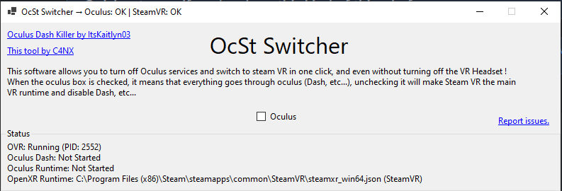

# OcSt Switcher

Switch from Oculus to Steam VR and from Steam VR to oculus easily on rift/quest and quest 2.

This project uses the excellent little project [Oculus Killer](https://github.com/ItsKaitlyn03/OculusKiller) to disable oculus dash and make it go directly through the steam VR interface, it allows to save RAM, CPU and GPU, for small pc this is a very good solution.

## How to use ?

Download the [lastest release of OcSt](https://github.com/C4NX/OcStSwitcher/releases/latest/download/OcStSwitcher.exe)

This is simple, when the Oculus checkbox is checked, This is Oculus the main VR runtime. unckecked and Steam VR will take the seat !

## Issues

- The SteamVR and Oculus directories are not found on the x86 version.
- SteamVR freezes on a black screen while not detecting the correct oculus headset.